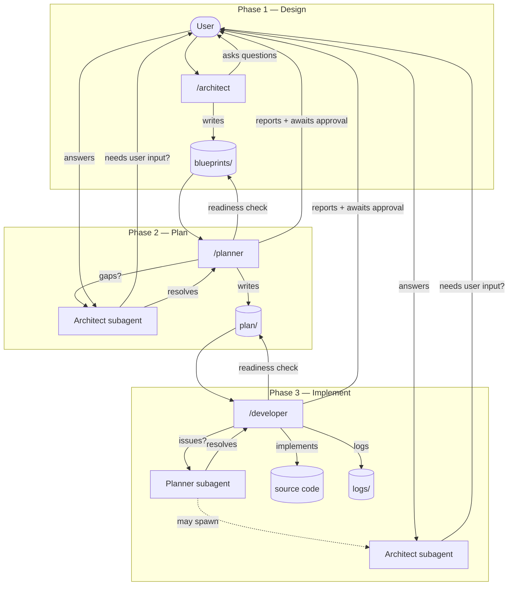

# agentic-dev-workflow


> **Stop context-switching between code and AI.** A structured three-agent workflow for Claude Code that keeps design, planning, and implementation cleanly separated — with a decision authority matrix that ensures agents resolve blockers autonomously before ever interrupting you.

---

## The problem

When you build with AI agents today, you either:
- Get interrupted constantly with questions the agent should answer itself
- Let the agent run loose and come back to find it diverged from what you intended

This workflow fixes both. Three specialized agents — **Architect**, **Planner**, **Developer** — each know exactly what they own, what to delegate, and when (rarely) to ask you.

---

## The Pipeline



Each phase gate follows the same rule: **agent surfaces findings → user decides → agent acts.** The subagent chain resolves as much as possible before reaching you.

---

## The Three Agents

### `/architect` — Design collaborator
Asks focused questions, proposes one clear recommendation per decision, writes blueprints. Never writes code. Never proceeds without your sign-off. When asked to review, audits all blueprints for completeness and consistency. **Always asks the user when context is insufficient** — even when spawned as a subagent. Structural decisions are never guessed at.

### `/planner` — Bridge between design and implementation
Checks blueprints are plannable before planning. Resolves gaps via Architect subagent (who may surface questions to the user). Produces `DEVELOPMENT_PLAN.md` and `TASKS.md`. Also spawned on-demand by Developer during implementation.

### `/developer` — Autonomous implementer
Checks tasks are executable before starting. Implements sequentially, marks tasks complete immediately, logs everything. Spawns Planner for any blocker — reaching you only as a last resort. The only agent that truly shields the user from implementation noise.

---

## Decision Authority Matrix

| Decision | Developer | → Planner | → Architect | → User |
|----------|:---------:|:---------:|:-----------:|:------:|
| Implementation details within a function | ✓ | | | |
| New file/module not in the plan | | ✓ | | |
| API contract change | | ✓ | | |
| New dependency needed | | ✓ | | |
| Blueprint ambiguity (resolvable from context) | | ✓ | | |
| Conflicting requirements between blueprints | | | ✓ | |
| New requirement not in any blueprint | | | ✓ | |
| Product/business judgment | | | | ✓ |
| Security/compliance decision | | | | ✓ |

---

## In Action

After a Developer session, `agentic/logs/AGENT_LOG.md` captures every inter-agent decision:

```markdown
## 2026-03-28T14:32:11 — Developer → Planner

**Context:** Implementing TASK-004: add image export to report renderer
**Question:** Blueprint specifies PNG export but doesn't say base64-embedded or file path. Two approaches have different implications for the ZIP bundle.
**Reasoning:** Blueprint §4 says bundle must be self-contained. Base64 satisfies this; file paths would create fragile dependencies.
**Decision:** Embed as base64 — self-contained bundle is an explicit architectural requirement.
**Escalated to Architect:** no
**Escalated to User:** no
**Decision ID:** DEC-007
```

And `agentic/plan/TASKS.md` stays current throughout:

```markdown
## Phase 1 — Core renderer

- [x] TASK-001: scaffold renderer module `src/renderer.py`
- [x] TASK-002: implement HTML section builders `src/sections/`
- [x] TASK-003: add WeasyPrint PDF export `src/renderer.py`
- [x] TASK-004: add PNG export with base64 embedding `src/renderer.py`
- [ ] TASK-005: implement ZIP bundle assembly `src/bundle.py`
```

---

## Project Folder Structure

All workflow documents live in `agentic/` — versioned alongside your code, never gitignored:

```
your-project/
  agentic/
    blueprints/    ← *_BLUEPRINT.md files (Architect)
    plan/          ← DEVELOPMENT_PLAN.md, TASKS.md (Planner)
    logs/          ← AGENT_LOG.md, DEVLOG.md, DEVIATIONS.md, CLARIFICATIONS.md
  src/
  tests/
  ...
```

| File | Purpose |
|------|---------|
| `blueprints/*_BLUEPRINT.md` | Scope, interfaces, data models, architectural decisions |
| `plan/DEVELOPMENT_PLAN.md` | Phases, milestones, risks |
| `plan/TASKS.md` | Granular task checklist |
| `logs/AGENT_LOG.md` | Every inter-agent decision — full audit trail |
| `logs/DEVLOG.md` | Developer session log |
| `logs/DEVIATIONS.md` | Every case where implementation differed from blueprint |
| `logs/CLARIFICATIONS.md` | Blueprint ambiguities resolved without a blueprint change |

---

## Installation

```bash
git clone https://github.com/luca-nik/agentic-dev-workflow.git
cd agentic-dev-workflow

mkdir -p ~/.claude/skills
ln -s $(pwd)/skills/architect ~/.claude/skills/architect
ln -s $(pwd)/skills/planner   ~/.claude/skills/planner
ln -s $(pwd)/skills/developer ~/.claude/skills/developer
```

Symlinks mean updates to this repo are reflected immediately — no reinstall needed. Verify with `/help` in Claude Code.

---

## Usage

**1. Set up your project**
```bash
cp templates/CLAUDE.md your-project/CLAUDE.md
```

**2. Design**
```
/architect
```
Architect asks questions, you answer, blueprints are written to `agentic/blueprints/`.

**3. Plan**
```
/planner
```
Planner validates blueprints, resolves gaps autonomously, reports to you, produces `agentic/plan/`.

**4. Implement**
```
/developer
```
Developer validates tasks, resolves issues autonomously, reports to you, implements. You only get interrupted if the full agent chain is stuck.

---

## Repository Structure

```
agentic-dev-workflow/
  skills/
    architect/
      SKILL.md
    planner/
      SKILL.md
      references/formats.md
    developer/
      SKILL.md
      references/formats.md
  templates/
    CLAUDE.md
    AGENT_LOG.md
    DEVIATIONS.md
    CLARIFICATIONS.md
    DEVELOPMENT_PLAN.md
    TASKS.md
  LICENSE
  README.md
```

---

## License

MIT — see [LICENSE](LICENSE).
