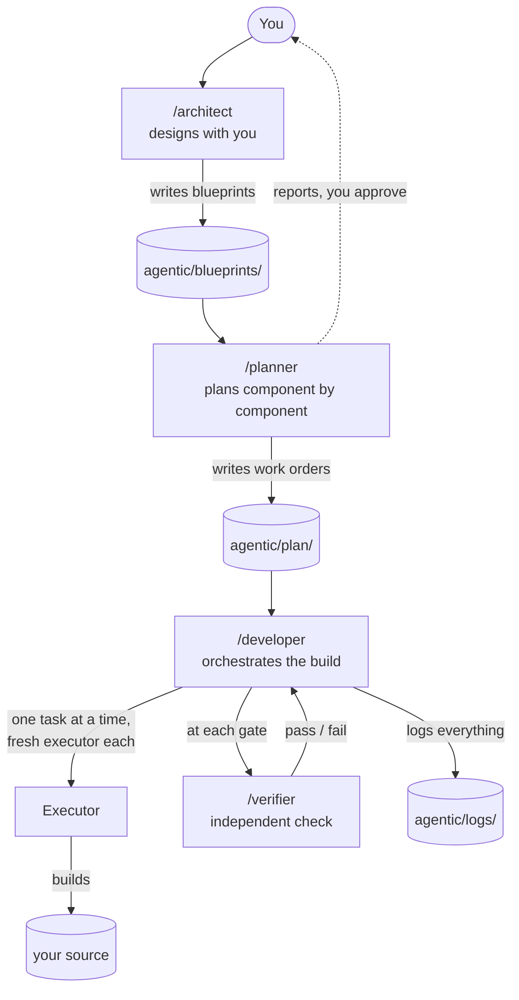

# agentic-dev-workflow


> A workflow for **Claude Code** that splits software work across four specialized agents — one to **design**, one to **plan**, one to **build**, and one to **verify** — so the AI resolves what it can on its own and only interrupts you for decisions that are genuinely yours.

---

## What is this?

If you've built with an AI coding agent, you know the two ways it goes wrong:

- It **interrupts you constantly** with questions it should answer itself ("should I use a list or a dict?"), or
- It **runs off and diverges** — you come back and it has built something other than what you meant.

`agentic-dev-workflow` fixes both. It is a set of four **agents** (Claude Code *skills* that you install once and invoke with slash commands like `/architect`) plus a folder convention. Each agent owns one part of the job and knows exactly when to decide on its own and when to ask you.

The agents do **not** share a chat history. Instead they communicate through files in an `agentic/` folder inside your project — design documents, task definitions, and logs. That makes everything auditable, lets a fresh agent pick up exactly where another left off, and is what lets the heavy thinking happen once, up front, so the actual building can run largely unattended.

In short: you think *with* the AI at the start (design and plan), then it builds on its own, and an independent check catches the mistakes a single agent would otherwise repeat.

---

## The four agents

Each agent is a slash command you run inside your project. Three of them form the main pipeline (Design → Plan → Build); the fourth is an independent auditor.

### `/architect` — designs with you

Talks with you to design the system **before any code is written**. It asks short, focused questions (one at a time), and for each decision it proposes **one** recommendation with the trade-off spelled out — not a menu for you to puzzle through. It writes one *blueprint* per component: a document covering scope, the public interface (with concrete input→output examples), data structures, and architectural decisions.

- **Owns:** component boundaries, interfaces, data models, technology choices.
- **You interact:** yes — it asks you questions and waits for sign-off before writing anything.
- **Never does:** write code. Design and implementation are kept in separate hands on purpose.

### `/planner` — turns design into a buildable plan

Reads the blueprints and checks they're complete enough to build from (if not, it gets the Architect to fill the gaps — without bothering you). Then it produces the plan: a phased breakdown and, for every task, a self-contained **work order** (explained below). It decides task ordering, what to fake, and how hard each task is.

- **Owns:** task ordering, how features split into tasks, per-task difficulty.
- **You interact:** briefly — it reports the plan and you approve before building starts.
- **Key idea:** it does the hard thinking now so that building later can be mechanical.

### `/developer` — builds, task by task

This one is an **orchestrator**: it doesn't write code itself. For each task it starts a fresh *executor* (a short-lived sub-agent with a clean slate), hands it the work order, then **re-runs the task's acceptance checks itself** before trusting the result — an executor saying "done" is never enough. It commits after each task and routes any blocker to the Planner. You're interrupted only if the whole chain is stuck.

- **Owns:** driving the build, verifying each task, committing.
- **You interact:** rarely — it shields you from implementation noise.
- **Key idea:** one fresh executor per task, so a long session never bloats or drifts.

### `/verifier` — independently checks the work

A service agent that runs at the end of each component. It writes **black-box tests from the blueprint** — deliberately *not* looking at the implementation, the developer's own tests, or the logs. Why? Because an agent that misreads the spec writes code **and** tests that share the same mistake, and green tests lie. The Verifier is a second, independent reading of the contract that catches exactly that. Failures become fix tasks; if a component keeps failing, that's treated as a design problem, not a coding bug.

- **Owns:** independent verification at component gates.
- **You interact:** rarely — you can also run `/verifier` yourself to audit something.
- **Honest limit:** the Verifier and the builder are both AI, so they can share blind spots; it *reduces* correlated errors, it doesn't eliminate them. Your plan approval and the mechanical checks remain the only fully independent verdicts.

---

## How a project flows through them

Picture building a small library with two parts — a parser and a formatter.


```mermaid
flowchart TD
    U([You]) --> A["/architect<br/>designs with you"]
    A -- writes blueprints --> BP[(agentic/blueprints/)]
    BP --> P["/planner<br/>plans component by component"]
    P -- writes work orders --> PL[(agentic/plan/)]
    P -. reports, you approve .-> U
    PL --> D["/developer<br/>orchestrates the build"]
    D -- "one task at a time,<br/>fresh executor each" --> EX[Executor]
    EX -- builds --> CODE[(your source)]
    D -- "at each gate" --> V["/verifier<br/>independent check"]
    V -- pass / fail --> D
    D -- logs everything --> LG[(agentic/logs/)]
```

1. **Design.** You run `/architect`. It asks what you're building, proposes decisions, and writes a blueprint for the parser and one for the formatter — each with concrete examples of how the functions should behave.
2. **Plan.** You run `/planner`. It turns the blueprints into a phased plan. Phase 1 builds the parser (which stands alone); Phase 2 builds the formatter against a *fake* parser that just pretends to work; the final phase throws the fake away and wires the real parts together. Every task gets a work order, and every phase ends in a named check.
3. **Implement.** You run `/developer`. It works through the tasks: for each, it starts a fresh executor with that task's work order, the executor writes the code and its own tests, the Developer re-runs the acceptance check, commits, and moves on. At the end of a phase it hands off to the Verifier.

You can stop after any phase and everything done so far is on disk, versioned, and resumable.

---

## The ideas that make it work

**1. Files are the only shared memory.** Agents don't pass context to each other in a chat — they read and write documents under `agentic/`. That's what makes the work auditable and lets agents start fresh.

**2. Work orders make tasks self-contained.** A *work order* is a single file describing one task: what to build, which files to read, what the result must satisfy (often a command that must pass), what *not* to touch, and what to do if something is unclear. It's written to be complete enough that a fresh executor — even a smaller, cheaper model — can do the task without reading the rest of the project.

**3. Build component by component, integrate last.** Each part is built and tested **in isolation** against *fakes* (stand-ins for parts that don't exist yet), with a named **gate** (a check that must pass) closing each phase. Only the final phase wires the real parts together and runs end-to-end tests. This finds defects where they're cheapest to fix.

**4. A fresh executor per task.** Rather than one long agent session that drifts, the Developer starts a clean executor for each task. Long projects stay healthy, and if a task can't be done from its work order alone, that's a sign the *plan* was incomplete — the problem surfaces immediately instead of being hidden by accumulated context.

**5. Independent verification.** The Verifier checks the contract against the blueprint, not the implementation. It's the defense against the classic failure mode where an agent confidently builds the wrong thing and writes tests that agree with it.

**6. Escalation, not interruption.** When an agent is blocked, it doesn't pop up and ask you — sub-agents can't reach you directly. Instead it returns a flagged question up the chain (Developer → Planner → Architect), which resolves what it can. Only if it genuinely can't, the question reaches you. The chart below shows who decides what.

---

## Who decides what

| Decision | Developer | → Planner | → Architect | → You |
|----------|:---------:|:---------:|:-----------:|:------:|
| Details inside one function | ✓ | | | |
| New file or module not in the plan | | ✓ | | |
| Changing an interface / API | | ✓ | | |
| Adding a new dependency | | ✓ | | |
| Ambiguity resolvable from context | | ✓ | | |
| Conflicting requirements between parts | | | ✓ | |
| A brand-new requirement | | | ✓ | |
| Product / business judgment | | | | ✓ |
| Security or compliance | | | | ✓ |

Read it left to right: each agent tries to settle the decision; if it's outside its authority, it hands it right. You're the last resort, not the first.

---

## What gets written where

All workflow documents live in an `agentic/` folder inside your project, versioned alongside your code:

```
your-project/
  agentic/
    blueprints/       ← design documents (Architect)
    plan/             ← the plan and per-task work orders (Planner)
    logs/             ← decisions, deviations, and session logs (all agents)
  src/
  tests/
  ...
```

| File | What it is |
|------|------------|
| `blueprints/*_BLUEPRINT.md` | The design: scope, interfaces with examples, data models, decisions |
| `plan/DEVELOPMENT_PLAN.md` | Phases, gates, and risks |
| `plan/TASKS.md` | The task checklist (one line per task, each linking its work order) |
| `plan/tasks/TASK-NNN.md` | A self-contained work order for one task |
| `logs/AGENT_LOG.md` | Every question passed between agents, with the decision reached |
| `logs/DEVLOG.md` | The build session log |
| `logs/DEVIATIONS.md` | Where the code ended up differing from the blueprint |
| `logs/CLARIFICATIONS.md` | Ambiguities resolved without changing a blueprint |

---

## Installation

You need [Claude Code](https://claude.com/claude-code) installed. Then clone this repo and link the four skills into your Claude skills folder:

```bash
git clone https://github.com/luca-nik/agentic-dev-workflow.git
cd agentic-dev-workflow

mkdir -p ~/.claude/skills
ln -sfn $(pwd)/skills/architect ~/.claude/skills/architect
ln -sfn $(pwd)/skills/planner   ~/.claude/skills/planner
ln -sfn $(pwd)/skills/developer ~/.claude/skills/developer
ln -sfn $(pwd)/skills/verifier  ~/.claude/skills/verifier
```

Using symlinks means updates to this repo are picked up immediately — no reinstall. Confirm the skills appear with `/help` in Claude Code.

---

## Usage

In your project, copy the starter instructions file, then run the agents in order:

### 1. Set up your project

```bash
cp templates/CLAUDE.md your-project/CLAUDE.md
```

### 2. Design

```
/architect
```

Answer its questions; it writes blueprints to `agentic/blueprints/`.

### 3. Plan

```
/planner
```

It turns the blueprints into a phased plan with work orders, then reports to you for approval.

### 4. Implement

```
/developer
```

It builds the tasks one by one, verifying each, and only interrupts you if the agent chain is genuinely stuck. Run `/verifier` any time you want an independent audit of a component.

---

## See it for real

The [`examples/wordfreq/`](examples/wordfreq/) directory is a complete, runnable walk-through: a tiny two-component library with real blueprints, work orders, a fake, a Verifier-written contract test, and the full log trail from a session. Run it:

```bash
cd examples/wordfreq && PYTHONPATH=src python -m pytest -q
```

---

## Repository structure

```
agentic-dev-workflow/
  skills/
    architect/SKILL.md            ← the agents themselves (these are the source of truth)
    planner/SKILL.md
    planner/references/formats.md
    developer/SKILL.md
    developer/references/formats.md
    verifier/SKILL.md
  templates/                      ← starter files copied into a new project
    CLAUDE.md, AGENT_LOG.md, DEVIATIONS.md, CLARIFICATIONS.md,
    DEVELOPMENT_PLAN.md, TASKS.md, WORK_ORDER.md
  examples/wordfreq/              ← runnable end-to-end demo
  .github/workflows/lint.yml      ← markdown linting on push/PR
  .markdownlint.json
  LICENSE
  README.md
```

> The `SKILL.md` files are the precise, normative specification of each agent's behavior; this README is a friendly overview. When in doubt, the skills win.

---

## License

MIT — see [LICENSE](LICENSE).
