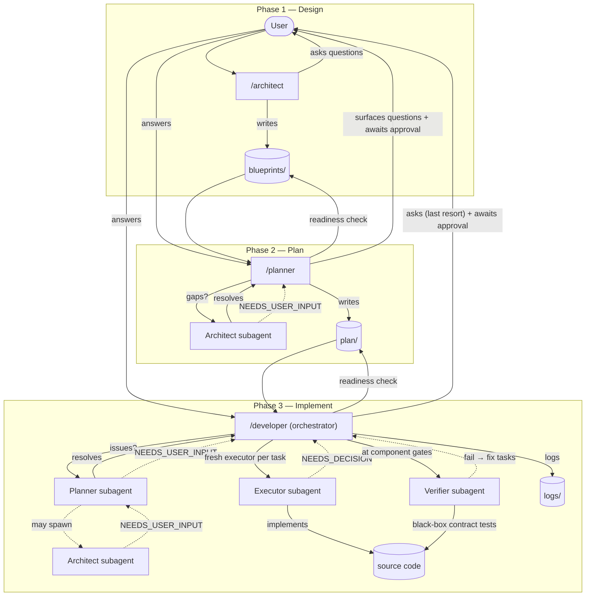

# agentic-dev-workflow


> **Stop context-switching between code and AI.** A structured four-agent workflow for Claude Code that keeps design, planning, implementation, and verification cleanly separated — with a decision authority matrix that ensures agents resolve blockers autonomously before ever interrupting you.

---


## The problem

When you build with AI agents today, you either:

- Get interrupted constantly with questions the agent should answer itself
- Let the agent run loose and come back to find it diverged from what you intended

This workflow fixes both. Three pipeline agents — **Architect**, **Planner**, **Developer** — plus an independent **Verifier** each know exactly what they own, what to delegate, and when (rarely) to ask you.

---

## The Pipeline


```mermaid
flowchart TD
    U([User]) --> A

    subgraph DESIGN ["Phase 1 — Design"]
        A["/architect"]
        A -- asks questions --> U
        A -- writes --> BP[(blueprints/)]
    end

    subgraph PLAN ["Phase 2 — Plan"]
        P["/planner"]
        P -- readiness check --> BP
        P -- gaps? --> AS[Architect subagent]
        AS -- resolves --> P
        AS -. "NEEDS_USER_INPUT" .-> P
        P -- "surfaces questions + awaits approval" --> U
        U -- answers --> P
        P -- writes --> PL[(plan/)]
    end

    subgraph IMPLEMENT ["Phase 3 — Implement"]
        D["/developer (orchestrator)"]
        D -- readiness check --> PL
        D -- issues? --> PS[Planner subagent]
        PS -. may spawn .-> AS2[Architect subagent]
        AS2 -. "NEEDS_USER_INPUT" .-> PS
        PS -- resolves --> D
        PS -. "NEEDS_USER_INPUT" .-> D
        D -- "asks (last resort) + awaits approval" --> U
        U -- answers --> D
        D -- "fresh executor per task" --> EX[Executor subagent]
        EX -- implements --> CODE[(source code)]
        EX -. "NEEDS_DECISION" .-> D
        D -- "at component gates" --> V[Verifier subagent]
        V -- "black-box contract tests" --> CODE
        V -. "fail → fix tasks" .-> D
        D -- logs --> LG[(logs/)]
    end

    BP --> P
    PL --> D
```

Each phase gate follows the same rule: **agent surfaces findings → user decides → agent acts.** The subagent chain resolves as much as possible before reaching you. Subagents never talk to you directly — a blocked subagent returns `NEEDS_USER_INPUT` up the chain, and the top-level agent asks.

> The `SKILL.md` files are the normative specification of agent behavior; this README is a descriptive overview.

---

## The Agents

### `/architect` — Design collaborator

Asks focused questions, proposes one clear recommendation per decision, writes blueprints. Never writes code. Never proceeds without your sign-off. When asked to review, audits all blueprints for completeness and consistency. **Structural decisions are never guessed at**: when context is insufficient — even as a subagent — it escalates to you (as a subagent, by returning `NEEDS_USER_INPUT` up the chain; the top-level agent asks).

### `/planner` — Bridge between design and implementation

Checks blueprints are plannable before planning. Resolves gaps via Architect subagent (who may surface questions to the user). Produces `DEVELOPMENT_PLAN.md` and `TASKS.md`. Also spawned on-demand by Developer during implementation.

### `/developer` — Implementation orchestrator

Validates work orders, then spawns a **fresh executor subagent per task** — clean context every time, model tier chosen per task by the Planner. Re-runs each task's acceptance commands itself before marking it done (an executor's "done" doesn't count), commits per task, and routes blockers to Planner subagents — reaching you only as a last resort. The only agent that truly shields the user from implementation noise.

### `/verifier` — Independent auditor (service agent)

At every component gate, writes **black-box contract tests derived from the blueprint** — deliberately blind to the implementation, its unit tests, and the dev log. An implementer who misreads the spec writes code *and* tests that share the misreading; the Verifier is the second, independent interpretation that catches it. Failures become fix tasks for fresh executors (max two rounds, then it's a design defect for the Planner). Also invocable on demand to audit any existing component. Honest limit: two LLMs share training priors — the Verifier reduces correlated misreading, it doesn't eliminate it; the mechanical checks and your plan approval are the only fully independent verdicts.

---

## Decision Authority Matrix

| Decision | Developer | → Planner | → Architect | → User |
|----------|:---------:|:---------:|:-----------:|:------:|
| Implementation details within a function | ✓ | | | |
| New file/module not in the plan | | ✓ | | |
| API contract change | | ✓ | | |
| New dependency needed | | ✓ | | |
| Blueprint ambiguity (resolvable from context) | | ✓ | | |
| Conflicting requirements between blueprints | | | ✓ | |
| New requirement not in any blueprint | | | ✓ | |
| Product/business judgment | | | | ✓ |
| Security/compliance decision | | | | ✓ |

---

## In Action

After a Developer session, `agentic/logs/AGENT_LOG.md` captures every inter-agent exchange as an append-only question/response pair:

```markdown
## 2026-03-28T14:32:11 — Developer → Planner (question)

**Context:** Implementing TASK-004: add image export to report renderer
**Question:** Blueprint specifies PNG export but doesn't say base64-embedded or file path. Two approaches have different implications for the ZIP bundle.
**What I established:** Blueprint §4 says bundle must be self-contained; file paths would create fragile dependencies.

## 2026-03-28T14:33:47 — Planner (response to 2026-03-28T14:32:11)

**Reasoning:** Blueprint §4 makes self-containment an explicit architectural requirement. Base64 satisfies it; file paths violate it.
**Decision:** Embed as base64.
**Escalated to Architect:** no
**Escalated to User:** no
**Decision ID:** DEC-007
```

And `agentic/plan/TASKS.md` stays current throughout — one line per task, each linking a self-contained work order:

```markdown
## Phase 1 — Renderer

- [x] TASK-001: scaffold renderer module → `tasks/TASK-001.md`
- [x] TASK-002: implement HTML section builders → `tasks/TASK-002.md`
- [x] TASK-003: add WeasyPrint PDF export → `tasks/TASK-003.md`
- [x] TASK-004: add PNG export with base64 embedding → `tasks/TASK-004.md`
- [ ] TASK-005: GATE — renderer contract tests green → `tasks/TASK-005.md`
```

---

## Project Folder Structure

All workflow documents live in `agentic/` — versioned alongside your code, never gitignored:

```
your-project/
  agentic/
    blueprints/    ← *_BLUEPRINT.md files (Architect)
    plan/          ← DEVELOPMENT_PLAN.md, TASKS.md, tasks/ (Planner)
    logs/          ← AGENT_LOG.md, DEVLOG.md, DEVIATIONS.md, CLARIFICATIONS.md
  src/
  tests/
  ...
```

| File | Purpose |
|------|---------|
| `blueprints/*_BLUEPRINT.md` | Scope, testable interfaces, data models, architectural decisions |
| `plan/DEVELOPMENT_PLAN.md` | Component phases, gates, risks |
| `plan/TASKS.md` | Task index and checklist |
| `plan/tasks/TASK-NNN.md` | Self-contained work order per task — contract, manifest, acceptance criteria, boundaries |
| `logs/AGENT_LOG.md` | Every inter-agent decision — full audit trail |
| `logs/DEVLOG.md` | Developer session log |
| `logs/DEVIATIONS.md` | Every case where implementation differed from blueprint |
| `logs/CLARIFICATIONS.md` | Blueprint ambiguities resolved without a blueprint change |

---

## Installation

```bash
git clone https://github.com/luca-nik/agentic-dev-workflow.git
cd agentic-dev-workflow

mkdir -p ~/.claude/skills
ln -sfn $(pwd)/skills/architect ~/.claude/skills/architect
ln -sfn $(pwd)/skills/planner   ~/.claude/skills/planner
ln -sfn $(pwd)/skills/developer ~/.claude/skills/developer
ln -sfn $(pwd)/skills/verifier  ~/.claude/skills/verifier
```

Symlinks mean updates to this repo are reflected immediately — no reinstall needed. Verify with `/help` in Claude Code.

---

## Usage

### 1. Set up your project

```bash
cp templates/CLAUDE.md your-project/CLAUDE.md
```

### 2. Design

```
/architect
```

Architect asks questions, you answer, blueprints are written to `agentic/blueprints/`.

### 3. Plan

```
/planner
```

Planner validates blueprints, resolves gaps autonomously, reports to you, produces `agentic/plan/`.

### 4. Implement

```
/developer
```

Developer validates tasks, resolves issues autonomously, reports to you, implements. You only get interrupted if the full agent chain is stuck.

---

## Repository Structure

```
agentic-dev-workflow/
  skills/
    architect/
      SKILL.md
    planner/
      SKILL.md
      references/formats.md
    developer/
      SKILL.md
      references/formats.md
    verifier/
      SKILL.md
  templates/
    CLAUDE.md
    AGENT_LOG.md
    DEVIATIONS.md
    CLARIFICATIONS.md
    DEVELOPMENT_PLAN.md
    TASKS.md
    WORK_ORDER.md
  examples/
    wordfreq/          ← runnable end-to-end demo (blueprints, work orders, logs, tests)
  .github/workflows/
    lint.yml           ← markdownlint on push/PR
  .markdownlint.json
  LICENSE
  README.md
```

A worked example lives in [`examples/wordfreq/`](examples/wordfreq/) — a tiny two-component project showing blueprints with acceptance examples, self-contained work orders, component phasing with a fake, a Verifier-written contract test, and the full log trail. Run it with `cd examples/wordfreq && PYTHONPATH=src python -m pytest -q`.

---

## License

MIT — see [LICENSE](LICENSE).
